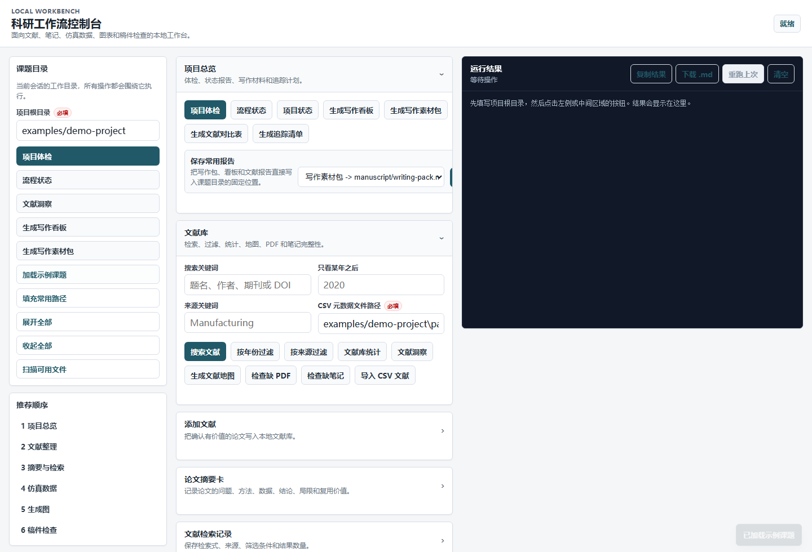
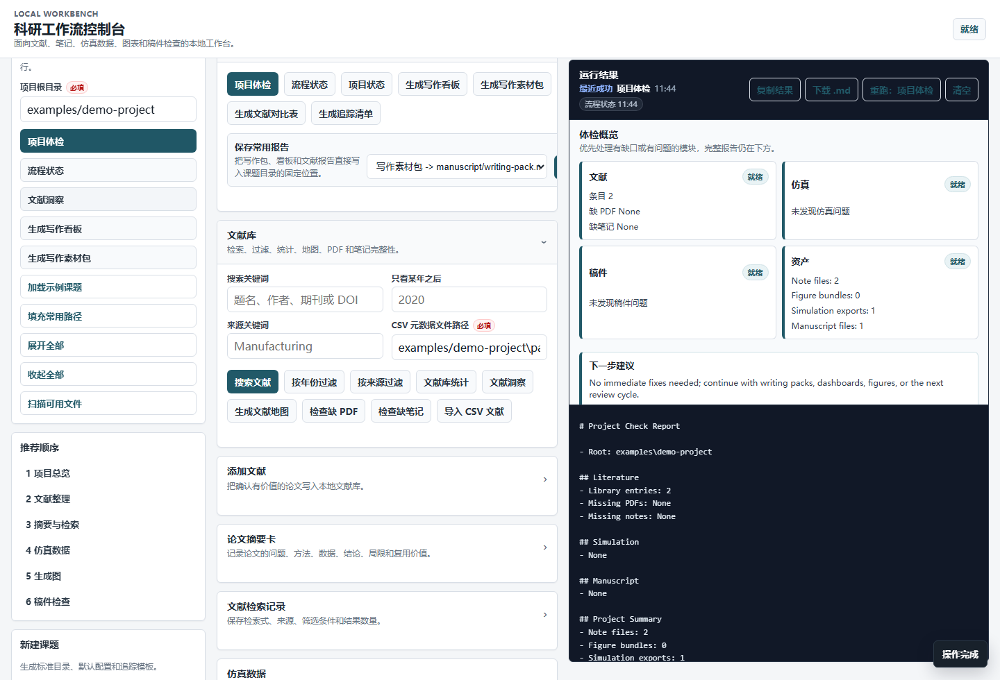

# 科研工作流工作台

中文 | [English](README.md)


这是一个本地优先的科研工作台，把文献笔记、仿真检查、可复现 SVG 图表和论文草稿 QA 串成一套新手也能用的流程。

它主要面向机械、制造和工程类科研场景：你可以继续用 Zotero 管文献、用 Word 写论文、从仿真软件导出数据，同时用这个工具把检查点、图表和写作材料放进同一个可追踪的本地工作区。




## 3 分钟试用 Demo

```powershell
.\start_web.bat
```

然后在本地网页里按顺序操作：

1. 加载 `examples/demo-project`。
2. 运行 `Workflow Status`。
3. 运行 `Scan Project Files`。
4. 运行 `Project Check`。
5. 任选一个文献、仿真、图表或论文检查功能试用。

示例项目已经包含文献库、占位 PDF、阅读笔记、仿真数据、论文草稿和项目体检配置，并且项目体检从零警告开始，适合先看效果，再迁移到自己的真实课题。

## 为什么做这个项目？

很多科研项目的问题不是“没有工具”，而是材料散在太多地方：论文文件夹、Zotero、阅读笔记、仿真结果、Excel 表格、图表草稿、论文正文各管一段。到写论文或投稿前，常见问题会集中爆发：文献缺摘要、PDF 找不到、仿真列名不统一、图表无法复现、正文引用和参考文献对不上。

这个项目不替代你的判断，也不替代 Zotero、Word、仿真软件和人工阅读。它做的是给科研流程加上可重复的检查点：

- 哪些论文已经收集、总结、引用？
- 哪些 PDF 或阅读笔记还缺失？
- 仿真数据列名是否稳定，数值列是否真的都是数字？
- 关键仿真结果是否超出设定范围？
- 图表是否能从同一份数据和设置重新生成？
- 论文草稿是否缺章节、引用、图号、图注、表注或参考文献？

## 核心能力

| 模块 | 能做什么 |
| --- | --- |
| 文献库 | 添加论文，导入 CSV/BibTeX 元数据，检索 Crossref 开放元数据，下载直链/开放 PDF，搜索本地条目，检查缺失 PDF 和笔记 |
| 阅读笔记 | 生成论文总结卡片和检索记录，方便后续综述和写作 |
| 写作准备 | 生成写作资料包、文献对比表、写作仪表盘、文献地图和后续检索计划 |
| 仿真数据 | 启动已安装求解器命令并记录日志，预览标准化列名，统计数值范围，校验必需列和单位元数据，检查超范围数值 |
| 图表生成 | 从 CSV/JSON 生成 SVG/JSON 图表包，支持趋势图、柱状图、误差线图、热力图和等值线图 |
| 论文检查 | 检查 Markdown、纯文本和 DOCX 草稿中的引用、标题层级、图号、图注、表注、DOCX 样式/页面设置、图片目标和替代文本、修订/批注痕迹和 Word 参考文献域问题 |
| 本地网页 | 不会敲 Python 命令也可以在浏览器里完成常用流程 |



## 适合谁？

- 机械、制造和工程方向，需要同时管理文献、仿真数据、图表和论文草稿的研究者。
- 想先用本地网页工作流、暂时不想手敲 Python 命令的学生。
- 仍然使用 Word 写作、Zotero 管参考文献，但希望关键检查可复现的人。
- 希望用普通文件夹保存科研材料，而不是完全依赖云端平台的课题组。

## 你会得到什么产出？

- `literature/library-index.json` 本地文献元数据。
- 论文总结卡片和检索记录。
- 写作资料包、文献对比表、写作仪表盘、文献地图和检索追踪计划。
- 仿真数据预览、校验、统计和范围检查报告。
- SVG 图表和配套 JSON FigureSpec 设置文件。
- 论文草稿引用、章节、图号、图注、表注和参考文献检查报告。

## 快速开始

### 方式 A0：Windows 一键安装

在 Windows 上可以直接双击 `install_windows.bat`，或运行：

```powershell
.\install_windows.bat
```

它会创建本地 `.venv`，验证网页模块能启动，并在项目文件夹和桌面生成 `Research Workflow Web.bat` 启动器。之后双击这个启动器即可打开网页工作台。

### 方式 A：本地网页界面

如果你不熟悉命令行，优先用网页：

```powershell
.\start_web.bat
```

启动器会在本机 `127.0.0.1` 打开网页；如果 `8000` 端口被占用，会自动尝试后面的端口，并打开实际可用的网址。

建议第一次这样试：

1. 打开网页。
2. 加载 `examples/demo-project` 示例项目。
3. 点击工作流状态。
4. 扫描项目文件。
5. 运行项目体检。
6. 按页面推荐顺序试文献、仿真、图表和论文检查功能。

网页专用教程：[WEB_GUIDE.md](WEB_GUIDE.md)

### 方式 B：命令行

如果你熟悉命令行，可以使用当前环境里的 Python：

```powershell
$PY='C:\path\to\python.exe'
& $PY -m workflow.cli init C:\path\to\workspace --slug demo-project --name "Demo Project"
```

可选：仓库现在包含 `pyproject.toml`，开发者可以用可编辑安装获得 `research-workflow` 和 `research-workflow-web` 命令入口：

```powershell
& $PY -m pip install -e . --no-build-isolation
```

生成项目体检报告：

```powershell
& $PY -m workflow.cli project check C:\path\to\workspace
```

报告末尾会包含 `Next Actions`，把缺 PDF、缺笔记、仿真问题和稿件问题转换成更具体的下一步处理建议。

生成写作资料包：

```powershell
& $PY -m workflow.cli project writing-pack C:\path\to\workspace --out writing-pack.md
```

从仿真数据生成图表：

```powershell
& $PY -m workflow.cli figure from-data simulation/result.csv figures --stem stress-response --title "Stress response" --figure-type trend --x-column time --y-column stress --x-label "Time (s)" --y-label "Stress (MPa)"
```

完整中文新手教程：[USER_GUIDE.md](USER_GUIDE.md)

## 示例项目

可运行示例放在 [examples/demo-project](examples/demo-project)，里面包括：

- 小型文献库
- 文献库条目对应的占位 PDF
- 论文总结笔记
- 仿真 CSV 数据
- 论文草稿
- 项目体检配置
- 文献追踪计划

建议先用这个示例项目熟悉流程，再迁移到自己的真实课题。

## 截图

真实浏览器截图放在 [docs/screenshots](docs/screenshots)，来自 `examples/demo-project`：

- [网页工作台首页](docs/screenshots/web-workbench-home.png)
- [流程状态卡片](docs/screenshots/workflow-status.png)
- [项目体检卡片](docs/screenshots/project-check.png)

重新采集前先运行 `python tools/check_js_syntax.py` 检查前端脚本语法；安装 Playwright 的 Chromium 浏览器后，可以用 `node tools/capture_web_screenshots.js` 重新采集。

## 项目成熟度

这是一个早期的本地优先工作台，不是成熟的软件生态。当前版本适合试用、评估流程和做小范围贡献；项目已经包含示例项目、网页界面、CLI、CI、隐私扫描、引用元数据，以及覆盖主要工作流模块、网页 action 和 JavaScript 语法检查工具的 170 个 unittest。

## 项目结构

新建工作区会使用下面的结构：

```text
literature/      论文文件和 library-index.json
notes/           检索记录、论文总结、对比表、文献地图、追踪计划
manuscript/      论文草稿和写作报告
simulation/      仿真导出数据和元数据
figures/         生成的 SVG/JSON 图表包
templates/       可复用 Markdown 模板
project-check.json
literature-tracker.json
```

## 这个项目和普通脚本有什么不同？

- 本地优先：数据保存在普通文件和文件夹里，不需要账号。
- 新手可用：常用功能可以通过本地网页点击完成。
- 可脚本化：同一套功能也能用命令行运行，适合复现和自动化。
- 面向科研流程：文献、仿真、图表和论文检查放在同一套流程里。
- 保留人工判断：工具负责暴露缺口和风险，不替你做黑箱决策。
- 图表可复现：SVG 图表会配套保存 JSON 设置文件。

## 和其他工具的关系

| 工具 | 主要关注点 | 和本项目的关系 |
| --- | --- | --- |
| Zotero | 参考文献管理 | 继续使用 Zotero；本项目补充本地阅读笔记、缺口检查和写作资产整理。 |
| Word | 论文正文写作 | 继续用 Word 写作；本项目做轻量文本和结构检查。 |
| Snakemake | 通用计算工作流 | 更适合复杂计算流水线；本项目更窄，更面向新手科研工作台。 |
| Cookiecutter Data Science | 数据项目结构 | 都强调目录纪律；本项目更偏文献、仿真、图表和论文检查。 |
| 本项目 | 本地科研工作台 | 把文献、仿真导出、图表包和论文 QA 串到同一个网页/CLI 流程里。 |

## 文档入口

- [英文 README](README.md)
- [中文新手教程](USER_GUIDE.md)
- [网页界面专用教程](WEB_GUIDE.md)
- [英文新手教程](USER_GUIDE.en.md)
- [示例说明](examples/README.md)
- [贡献指南](CONTRIBUTING.md)
- [安全策略](SECURITY.md)
- [更新日志](CHANGELOG.md)
- [路线图](ROADMAP.md)

## 参与贡献

如果问题或改进建议符合“本地优先科研工作流”的范围，欢迎提交 issue 或 pull request。请优先使用 GitHub issue 模板；如果问题依赖 CSV、Markdown、DOCX 或文献库输入，请提供已经脱敏的最小示例。

提交 PR 前，请先运行测试，并确认没有提交个人路径、密钥、未公开论文内容或私有科研数据。

## 引用

如果这个工作台对你的科研流程有帮助，可以使用 [CITATION.cff](CITATION.cff) 将它作为软件引用。v0.1.0 的引用文件先采用 contributors 形式；后续维护者信息更稳定后再继续细化。

## 这个项目不做什么

- 文献发现仅使用 Crossref 开放元数据和用户提供的直链/开放 PDF，不绕过出版社权限、学校登录或付费墙。
- 不替代 Zotero、Word 或人工阅读判断。
- 不直接控制 ANSYS、Abaqus、COMSOL 等商业求解器 GUI、许可证或模型设置。
- 不自动生成整篇论文或学位论文。

## 当前限制

- DOCX 检查会检查文本和包级信号，包括页面大小是否存在、页面宽高是否完整、页眉/页脚部件引用、嵌入图片目标、图片替代文本元数据和修订/批注痕迹，但不渲染 Word 页面，也不完整校验学校模板格式。
- 等值线图输入必须是完整矩形网格。
- BibTeX 解析重点支持常见 article 字段。

## 验证

```powershell
& $PY -m unittest discover -v
```

## 建议填写的 GitHub About

Description:

```text
Local-first research workflow workbench for literature notes, simulation data checks, publication figures, and manuscript QA.
```

Topics:

```text
research-workflow, reproducible-research, academic-writing, literature-review, manuscript, simulation-data, scientific-figures, local-first, python
```
