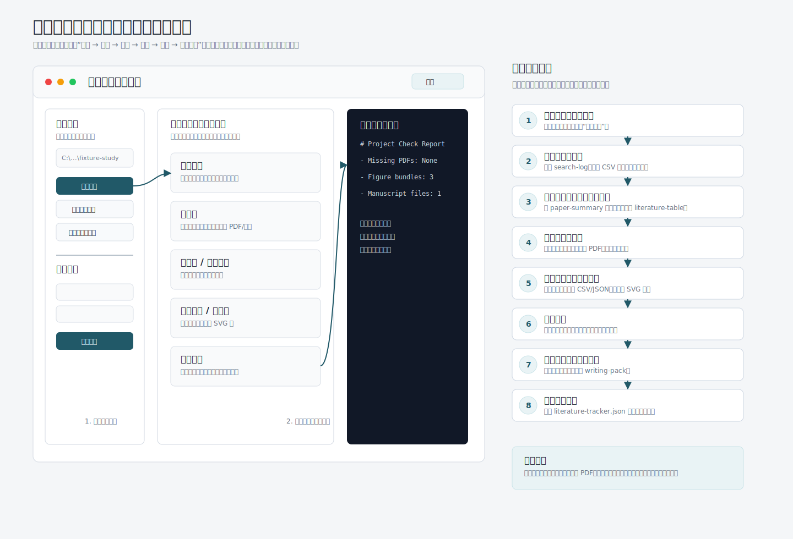

# 全科研工作流新手使用教程

Language: [English](USER_GUIDE.en.md) | 中文

本文档面向第一次使用本工作流的人。目标是让你知道：每个文件夹放什么、每一步运行什么命令、什么时候必须人工确认，以及结果应该去哪里找。

请用支持 UTF-8 的编辑器查看和编辑本文档。如果在 Windows PowerShell 里看到乱码，优先确认读取编码是不是 UTF-8。

以后新增面向用户的功能时，教程统一更新到本文件，不再另建分散的教程文件。

## 1. 这套工具做什么

这套工作流不是直接替你完成整篇论文，而是把科研过程拆成可追踪的步骤：

1. 检索论文并记录检索过程。
2. 下载 PDF 后人工判断是否值得入库。
3. 给论文做摘要卡片，保留可引用的结论、页码和局限。
4. 生成论文提纲、综述段和写作素材。
5. 接收 ANSYS、Abaqus、COMSOL 等软件导出的 CSV/JSON 数据。
6. 检查仿真数据字段、数值和单位。
7. 用 Python 生成论文图，包括折线图、柱状图、误差棒图、热力图和等值线图。
8. 检查论文草稿里的引用、图号、章节和本地文献库覆盖情况。

人工确认点很重要：论文是否可靠、仿真设置是否合理、图是否能进论文，都需要你确认。

## 2. 两个目录不要混淆

当前目录是工具本体：

```text
C:\Users\22676\Documents\科研
```

以后每个真实课题都建议单独建一个项目目录，例如：

```text
C:\Users\22676\Documents\fixture-study
```

工具本体负责提供命令；课题目录负责存放论文、笔记、仿真数据和生成的图。

## 3. 不会用 Python 时，先用本地网页界面

如果你不想手敲命令，直接双击工具目录里的：

```text
C:\Users\22676\Documents\科研\start_web.bat
```

它会启动本地网页服务，并打开：

```text
http://127.0.0.1:8000
```

网页里先填写你的课题目录，例如：

```text
C:\Users\22676\Documents\fixture-study
```

网页界面和推荐使用顺序可以先看这张示意图：



然后可以直接点击按钮运行：

- 新建课题。
- 项目体检。
- 项目状态。
- 文献库统计。
- 文献搜索。
- 导入 CSV 文献元数据。
- 检查缺 PDF。
- 检查缺笔记。
- 添加文献。
- 生成论文摘要卡。
- 生成文献检索记录。
- 预览仿真 CSV/JSON 数据。
- 汇总仿真数值范围。
- 校验仿真数据列和数值列。
- 从 CSV/JSON 生成基础 SVG 图。
- 检查论文稿件章节、图号和引用。
- 生成写作素材包。
- 生成文献对比表。
- 生成写作看板。
- 生成文献地图。
- 生成新文献追踪清单。

网页服务只在本机运行，地址是 `127.0.0.1`。默认使用 `8000` 端口；如果端口被占用，工具会自动尝试 `8001` 到 `8009`，并打开实际可用的地址。如果浏览器打不开，先确认 `start_web.bat` 的窗口没有被关掉；窗口关闭后网页服务也会停止。

## 4. 打开 PowerShell 并设置 Python

先进入工具目录：

```powershell
cd C:\Users\22676\Documents\科研
```

设置本环境可用的 Python 路径：

```powershell
$PY='C:\Users\22676\.cache\codex-runtimes\codex-primary-runtime\dependencies\python\python.exe'
```

后面所有命令都默认你已经设置了 `$PY`。

## 4. 10 分钟快速试跑

第一次使用时，先用仓库自带的 `examples` 快速确认工具能跑起来。

检查示例仿真数据：

```powershell
& $PY -m workflow.cli simulation validate-data C:\Users\22676\Documents\科研\examples\simulation-result.csv `
  --required-column time `
  --required-column stress `
  --numeric-column time `
  --numeric-column stress
```

生成一张示例图：

```powershell
& $PY -m workflow.cli figure from-data C:\Users\22676\Documents\科研\examples\simulation-result.csv C:\Users\22676\Documents\科研\examples\output `
  --stem quick-check `
  --title "Quick check" `
  --figure-type trend `
  --x-column time `
  --y-column stress `
  --x-label "Time (s)" `
  --y-label "Stress (MPa)"
```

检查示例稿件：

```powershell
& $PY -m workflow.cli manuscript check C:\Users\22676\Documents\科研\examples\chapter.md `
  --required-section Introduction `
  --expected-figure "Figure 1"
```

这三步能跑通，再开始创建自己的课题目录。

## 5. 创建一个新课题

示例：创建一个夹具优化课题。

```powershell
& $PY -m workflow.cli init C:\Users\22676\Documents --slug fixture-study --name "夹具优化研究"
```

生成的目录大致如下：

```text
fixture-study
├── literature    # PDF、文献索引 library-index.json
├── notes         # 检索记录、论文摘要、提纲、综述段
├── manuscript    # 论文草稿
├── simulation    # 仿真软件导出的数据
├── figures       # 生成的论文图
├── templates     # 可复用模板
├── project-check.json  # 一键体检配置
└── literature-tracker.json  # 新文献追踪主题
```

`project-check.json` 记录默认体检规则，例如稿件必须包含哪些章节、预期有哪些图号、仿真数据必须有哪些列、哪些列必须是数字、单位元数据文件在哪里。新手可以先不改它，等课题结构稳定后再调整。
`literature-tracker.json` 记录需要持续检索的研究主题、关键词、数据库来源和上次检索日期。新建课题时会先给出一个示例主题，你可以按自己的方向改成真实关键词。

其中 `simulation.ranges` 可以写仿真结果的合理范围，例如：

```json
{"stress":[0,1000]}
```

这样运行 `project check` 时会自动报告超出范围的仿真结果。

## 6. 记录一次论文检索

在 Google Scholar、Web of Science、Scopus、知网等平台检索后，用命令把检索条件记录下来。

```powershell
& $PY -m workflow.cli note search-log C:\Users\22676\Documents\fixture-study\notes `
  --question "自适应夹具优化研究" `
  --keyword "adaptive fixture" `
  --keyword "clamping force optimization" `
  --query "adaptive fixture clamping force optimization" `
  --source "Google Scholar" `
  --date "2026-05-18" `
  --filters "2020-2026" `
  --result-count 12 `
  --notes "优先关注机械结构、夹紧力、有限元验证"
```

运行后会在 `notes` 目录生成一份检索记录。

## 7. 下载 PDF 后先人工确认

把下载的 PDF 放到：

```text
C:\Users\22676\Documents\fixture-study\literature
```

入库前先检查：

- 这篇论文是否和课题相关。
- 是否有明确方法、数据、图表或结论。
- 结论是否能被你的论文复用。
- 是否有明显局限或不适用条件。

不建议把所有下载的 PDF 都入库。只把确认有价值的论文加入文献库。

## 8. 给论文做摘要卡片

```powershell
& $PY -m workflow.cli note paper-summary C:\Users\22676\Documents\fixture-study\notes `
  --title "Adaptive clamping fixture design" `
  --author "Zhang" `
  --author "Li" `
  --source "Journal of Manufacturing Systems" `
  --year 2024 `
  --doi "10.1000/example" `
  --problem "传统夹具对复杂零件适应性差" `
  --method "建立自适应夹紧机构并用有限元验证" `
  --data "夹紧力、变形量、应力分布" `
  --key-figures "Fig. 3 结构示意图；Fig. 6 应力云图" `
  --main-result "夹紧变形降低约20%" `
  --limitation "实验样本较少" `
  --reuse-value "可借鉴其夹紧力评价指标" `
  --source-pages "pp. 4-8"
```

摘要卡片要写清楚“结论来自哪几页”，后面写论文时才方便回查。

## 9. 把确认过的论文加入文献库

单篇手动加入：

```powershell
& $PY -m workflow.cli library add C:\Users\22676\Documents\fixture-study\literature `
  --title "Adaptive clamping fixture design" `
  --author "Zhang" `
  --author "Li" `
  --year 2024 `
  --source "Journal of Manufacturing Systems" `
  --doi "10.1000/example" `
  --pdf-name "adaptive-clamping-fixture-design.pdf" `
  --note-path "notes/paper-summary-adaptive-clamping-fixture-design.md"
```

如果你从 Scopus、Web of Science、Crossref 或其他平台导出了论文元数据 CSV，可以批量导入：

```powershell
& $PY -m workflow.cli library import-csv C:\Users\22676\Documents\fixture-study\literature C:\Users\22676\Documents\fixture-study\papers.csv
```

CSV 常见列名会自动识别，包括 `Title`、`Article Title`、`Authors`、`Author full names`、`Year`、`Publication Year`、`Source title`、`Publication Name`、`Journal`、`DOI`、`PDF`、`File`、`Notes`、`Note`。Scopus 导出的作者全名列、Web of Science 导出的期刊名列也会尽量自动匹配。导入时按 DOI 优先、标题其次去重。

平台导出的 CSV 通常没有本地 PDF 文件名，所以导入后 `PDF` 字段可能为空。你可以后续手动整理 `literature` 文件夹里的 PDF 文件名，或用 `library check-pdfs` 检查哪些条目还没有对应 PDF。

查看文献库：

```powershell
& $PY -m workflow.cli library list C:\Users\22676\Documents\fixture-study\literature
```

如果文献越来越多，可以按题名、作者、来源期刊或 DOI 关键词搜索：

```powershell
& $PY -m workflow.cli library search C:\Users\22676\Documents\fixture-study\literature "clamping"
```

搜索不区分大小写，适合在写综述、补 PDF 或回查某篇论文时快速定位条目。输出里会列出匹配论文的题名、作者、年份、来源、DOI、PDF 文件名和笔记路径。

如果只想看最近几年的文献，可以按年份过滤：

```powershell
& $PY -m workflow.cli library recent C:\Users\22676\Documents\fixture-study\literature --since 2020
```

这会列出 `2020` 年及之后发表的条目，适合写研究现状前先筛近期文献。

如果只想看某个期刊或会议来源，可以按来源关键词过滤：

```powershell
& $PY -m workflow.cli library source C:\Users\22676\Documents\fixture-study\literature "Manufacturing"
```

这会在文献来源字段里查找关键词，适合检查某个期刊、会议或数据库来源下有哪些条目。

检查 PDF 是否缺失：

```powershell
& $PY -m workflow.cli library check-pdfs C:\Users\22676\Documents\fixture-study\literature
```

检查摘要卡或阅读笔记是否缺失：

```powershell
& $PY -m workflow.cli library check-notes C:\Users\22676\Documents\fixture-study\literature
```

`note-path` 通常写成 `notes/xxx.md`。如果文献库目录是课题目录下的 `literature`，工具会到同一个课题目录下的 `notes` 文件夹检查这个文件是否存在。缺笔记的论文建议先补 `paper-summary`，否则后面写综述时很难回查证据。

查看文献库统计：

```powershell
& $PY -m workflow.cli library stats C:\Users\22676\Documents\fixture-study\literature
```

它会显示文献总数、年份范围、缺失 PDF 数量、缺失笔记数量、来源期刊或会议分布，以及作者分布。写综述或准备投稿前，可以用它快速判断文献库是否太旧、PDF 和摘要卡是否还没补齐、来源或作者是否过于集中。

导出 BibTeX，后续可导入 Zotero：

```powershell
& $PY -m workflow.cli library export-bibtex C:\Users\22676\Documents\fixture-study\literature C:\Users\22676\Documents\fixture-study\export.bib
```

也可以把基本 BibTeX 条目导回本地文献库：

```powershell
& $PY -m workflow.cli library import-bibtex C:\Users\22676\Documents\fixture-study\literature C:\Users\22676\Documents\fixture-study\export.bib
```

## 10. 生成论文提纲

```powershell
& $PY -m workflow.cli note outline C:\Users\22676\Documents\fixture-study\notes `
  --topic "自适应夹具优化研究" `
  --problem-statement "复杂零件加工中夹具适应性和夹紧稳定性不足" `
  --section "Introduction:研究背景|现有问题|本文贡献" `
  --section "Method:结构设计|仿真模型|评价指标" `
  --section "Results:夹紧力结果|应力结果|对比分析" `
  --conclusion "提出一种可验证的夹具优化流程"
```

提纲适合先生成，再人工改成自己的章节结构。

## 11. 生成综述段素材

```powershell
& $PY -m workflow.cli note literature-review C:\Users\22676\Documents\fixture-study\notes `
  --paper "Zhang et al. 2024" `
  --claim "自适应夹具可以降低复杂零件装夹变形" `
  --evidence "作者通过有限元比较了传统夹具和自适应夹具的应力分布" `
  --connection "本文可沿用其夹紧力评价指标，并进一步加入制造约束" `
  --limit "该研究实验样本较少，泛化能力仍需验证"
```

综述段里的每个关键结论都要能回链到论文、页码或摘要卡片。

## 12. 接入仿真数据

从 ANSYS、Abaqus、COMSOL 等软件导出 CSV 或 JSON，放到：

```text
C:\Users\22676\Documents\fixture-study\simulation
```

CSV 读取时会自动识别一部分常见仿真软件表头，并转换成稳定列名：

- 时间：`Time [s]`、`Step Time`、`t (s)` → `time`
- 应力：`Equivalent Stress [MPa]`、`S: Mises`、`solid.mises (MPa)` → `stress`
- 位移或变形：`Total Deformation [mm]`、`U: Magnitude`、`solid.disp (mm)` → `displacement`
- 反力或载荷：`RF: Magnitude`、`Reaction Force` → `force`
- 温度：`T (K)`、`Temperature` → `temperature`

因此，很多从 ANSYS、Abaqus、COMSOL 直接导出的 CSV，可以先用 `time`、`stress`、`displacement`、`force`、`temperature` 这些标准列名检查和画图。如果某个软件导出的表头暂时没有被识别，就按 CSV 里的原始列名传给命令。

假设导出的文件是：

```text
C:\Users\22676\Documents\fixture-study\simulation\result.csv
```

先查看工具识别出的列名和前几行数据：

```powershell
& $PY -m workflow.cli simulation inspect-data C:\Users\22676\Documents\fixture-study\simulation\result.csv --rows 5
```

如果输出里看到：

```text
Columns: time, stress, displacement
```

说明表头已经被识别成标准列名，后续命令就可以直接使用这些列名。

再查看数值列的大致范围：

```powershell
& $PY -m workflow.cli simulation summarize-data C:\Users\22676\Documents\fixture-study\simulation\result.csv
```

它会列出每个数值列的有效数量、最小值和最大值。若某列既有数字又有坏值，仍会显示数字部分的范围，并在 `Non-numeric columns` 中提醒你这列需要回到原始数据检查。

如果你已经知道某些结果的合理范围，可以先做范围检查：

```powershell
& $PY -m workflow.cli simulation check-ranges C:\Users\22676\Documents\fixture-study\simulation\result.csv `
  --range stress:0:500 `
  --range displacement:0:5
```

`--range` 的格式是 `列名:最小值:最大值`，可以重复写多次。报告里的 `Out-of-range` 表示超出范围的行数，`Non-numeric` 表示该列里不能转成数字的单元格数量。

如果里面有 `time` 和 `stress` 两列，再检查数据：

```powershell
& $PY -m workflow.cli simulation validate-data C:\Users\22676\Documents\fixture-study\simulation\result.csv `
  --required-column time `
  --required-column stress `
  --numeric-column time `
  --numeric-column stress
```

如果有单位元数据文件，例如：

```json
{"columns":{"time":"s","stress":"MPa"}}
```

可以一起检查：

```powershell
& $PY -m workflow.cli simulation validate-data C:\Users\22676\Documents\fixture-study\simulation\result.csv `
  --required-column time `
  --required-column stress `
  --numeric-column time `
  --numeric-column stress `
  --metadata C:\Users\22676\Documents\fixture-study\templates\simulation-metadata.json
```

报告里的常见提示：

- `Missing columns`：缺少必要列。
- `Non-numeric columns`：本该是数字的列里有文本或空值。
- `Missing unit metadata`：数值列没有单位记录。
- `Empty unit metadata`：单位字段存在但为空。
- `Extra unit metadata`：元数据里写了数据表不存在的列。

## 13. 生成论文图

### 折线图

适合时间响应、载荷-变形曲线等连续数据：

```powershell
& $PY -m workflow.cli figure from-data C:\Users\22676\Documents\fixture-study\simulation\result.csv C:\Users\22676\Documents\fixture-study\figures `
  --stem stress-response `
  --title "Stress response" `
  --figure-type trend `
  --x-column time `
  --y-column stress `
  --x-label "Time (s)" `
  --y-label "Stress (MPa)"
```

### 柱状图

适合不同方案、工况或样本的对比。把 `--figure-type trend` 改成：

```powershell
--figure-type bar
```

### 误差棒图

如果仿真或实验数据里有均值列和误差列，例如 `stress` 与 `stress_sd`：

```powershell
& $PY -m workflow.cli figure from-data C:\Users\22676\Documents\fixture-study\simulation\result.csv C:\Users\22676\Documents\fixture-study\figures `
  --stem stress-error `
  --title "Stress response" `
  --figure-type errorbar `
  --x-column time `
  --y-column stress `
  --y-error-column stress_sd `
  --x-label "Time (s)" `
  --y-label "Stress (MPa)"
```

每个 `--y-column` 需要对应一个 `--y-error-column`。

### 热力图和等值线图

如果数据是 `x, y, value` 三列，可以生成二维图：

```powershell
& $PY -m workflow.cli figure from-data C:\Users\22676\Documents\fixture-study\simulation\grid.csv C:\Users\22676\Documents\fixture-study\figures `
  --stem temperature-field `
  --title "Temperature field" `
  --figure-type heatmap `
  --x-column x `
  --y-column y `
  --value-column value `
  --x-label X `
  --y-label Y
```

把 `--figure-type heatmap` 改成 `--figure-type contour` 可以生成等值线图。等值线图要求数据形成完整矩形网格。

输出文件在 `figures` 目录：

```text
figures\stress-response.svg
figures\stress-response.json
```

`.svg` 是图，可以放进论文；`.json` 是图形参数和数据来源记录，方便以后复现。

## 14. 检查论文草稿

把草稿放到：

```text
C:\Users\22676\Documents\fixture-study\manuscript
```

检查 Markdown、纯文本或基础 `.docx`：

```powershell
& $PY -m workflow.cli manuscript check C:\Users\22676\Documents\fixture-study\manuscript\chapter.md `
  --required-section Introduction `
  --required-section Method `
  --expected-figure "Figure 1" `
  --library-root C:\Users\22676\Documents\fixture-study\literature
```

它会检查：

- 文中识别到哪些引用。
- 文中识别到哪些图号。
- 指定章节是否存在。
- 文中引用是否能在本地文献库找到。
- 文献库中是否有未被引用的条目。
- 英文图号是否重复，例如重复出现 `Figure 1`。
- 英文图号是否跳号，例如有 `Figure 1`、`Figure 3` 但缺少 `Figure 2`。
- 中文图号是否跳号，例如有 `图 1`、`图 3` 但缺少 `图 2`。

章节检查支持常见中英文别名。例如配置里要求 `Introduction`，正文标题写 `引言` 或 `绪论` 也会通过；要求 `Method`，标题写 `方法` 或 `研究方法` 也会通过；要求 `Results`，标题写 `结果` 或 `结果与讨论` 也会通过。

引用检查支持单个引用 `[@zhang2024]`，也支持一组引用 `[@zhang2024; @li2023fixture]`。

## 15. 查看项目状态和一键体检

```powershell
& $PY -m workflow.cli project report C:\Users\22676\Documents\fixture-study
```

它会统计文献、笔记、图、仿真导出和论文草稿数量。

如果想一次性检查整个课题，运行：

```powershell
& $PY -m workflow.cli project check C:\Users\22676\Documents\fixture-study
```

`project check` 会汇总检查：

- 文献库条目数量。
- 文献库登记的 PDF 是否缺失。
- 文献库登记的摘要卡或阅读笔记是否缺失。
- 仿真 CSV/JSON 是否可读、必要列是否存在、数值列是否真是数字、单位元数据是否完整、数值是否超出 `project-check.json` 里设置的合理范围。
- 稿件是否缺章节、缺图号、缺引用、引用是否能在本地文献库找到、图号是否重复或跳号。
- 当前项目的笔记、图、仿真导出、稿件数量。

## 16. 生成写作素材包

```powershell
& $PY -m workflow.cli project writing-pack C:\Users\22676\Documents\fixture-study --out C:\Users\22676\Documents\fixture-study\writing-pack.md
```

`writing-pack.md` 会汇总当前课题中可用于写作的文献、笔记、图、仿真结果和论文草稿。开头还会附带文献库概览，包括文献总数、年份范围和缺失 PDF 数量，方便写作前先判断资料是否够用。

素材包还会单独列出：

- `Recent Literature (since 2020)`：2020 年及之后的近期文献，适合写研究现状时优先查看。
- `Library Gaps`：缺失的 PDF 和缺失的摘要卡或阅读笔记，适合写作前补材料。
- `Manuscript Drafts`：当前 `manuscript` 文件夹里的 `.md`、`.txt`、`.docx` 草稿。

如果你用本地网页界面，点击“生成写作素材包”也会看到这些内容。

## 17. 生成文献对比表

如果你已经为多篇论文生成了 `paper-summary` 摘要卡，可以把这些摘要卡汇总成一张对比表：

```powershell
& $PY -m workflow.cli project literature-table C:\Users\22676\Documents\fixture-study --out C:\Users\22676\Documents\fixture-study\literature-table.md
```

`literature-table.md` 会从 `notes` 文件夹里的 `# Paper Summary` 笔记中提取题名、作者、年份、来源、研究问题、方法、数据、主要结论、局限、可复用价值和来源页码。它适合在写综述前快速比较多篇论文的共同点和差异。

如果你用本地网页界面，点击“生成文献对比表”可以直接在网页右侧看到同样的表格。

## 18. 生成写作看板

写作看板会把“能直接用于写作的材料”和“还缺什么”放到一起：

```powershell
& $PY -m workflow.cli project writing-dashboard C:\Users\22676\Documents\fixture-study --out C:\Users\22676\Documents\fixture-study\writing-dashboard.md
```

它会按背景、方法、结果和草稿整理近期文献数量、摘要卡数量、仿真导出、图表包、稿件文件，以及缺失 PDF、缺失笔记等待补项。写论文前可以先看这份看板，再决定先补文献、补图，还是继续写正文。

## 19. 生成文献地图

文献地图是文本版的文献关系概览：

```powershell
& $PY -m workflow.cli library map C:\Users\22676\Documents\fixture-study\literature --out C:\Users\22676\Documents\fixture-study\literature-map.md
```

它会汇总年份分布、来源期刊或会议分布、作者分布，以及每个作者对应哪些论文。第一版先用文本报告，适合快速判断文献是否集中在某几年、某个来源或某几个作者。

## 20. 生成新文献追踪清单

先打开课题目录里的：

```text
C:\Users\22676\Documents\fixture-study\literature-tracker.json
```

把里面的 `topics` 改成你的真实研究方向、关键词、检索平台和上次检索日期。然后运行：

```powershell
& $PY -m workflow.cli project literature-tracker C:\Users\22676\Documents\fixture-study --out C:\Users\22676\Documents\fixture-study\literature-tracking-plan.md
```

它会把每个主题转换成下一次检索建议，包括检索式、关键词、来源平台和下一步动作。检索完后，建议继续生成 `search-log`，再把有价值的论文加入文献库。

如果你用本地网页界面，可以直接点击“生成写作看板”“生成文献地图”“生成追踪清单”。

## 21. 推荐的日常使用顺序

每个课题建议按这个顺序推进：

```text
检索论文
→ 记录 search-log
→ 下载 PDF
→ 人工确认是否入库
→ 写 paper-summary
→ literature-table
→ library add 或 library import-csv
→ library search / library stats / library check-pdfs / library check-notes
→ library map
→ 写 outline / literature-review
→ 做仿真并导出 CSV/JSON
→ simulation inspect-data
→ simulation summarize-data
→ simulation check-ranges
→ simulation validate-data
→ figure from-data
→ manuscript check
→ project check
→ project report
→ writing-pack
→ writing-dashboard
→ literature-tracker
```

## 22. 常见问题

### PowerShell 提示找不到 python

使用本文档提供的 `$PY` 路径，不要直接输入 `python`。

### 命令太长怎么办

PowerShell 里反引号 `` ` `` 表示换行。复制本文档的多行命令时，不要删除行尾反引号。

### 文档打开后中文乱码怎么办

请用 UTF-8 查看本文档。例如在 PowerShell 中使用：

```powershell
Get-Content C:\Users\22676\Documents\科研\USER_GUIDE.md -Encoding UTF8
```

### 生成的图在哪里

在课题目录的 `figures` 文件夹里。

### PDF 检查显示 missing

说明 `library-index.json` 里登记的 `pdf_name` 和实际 PDF 文件名不一致，或者 PDF 没放进 `literature` 文件夹。

### 能不能直接控制仿真软件

当前第一版还不直接控制 ANSYS、Abaqus、COMSOL。推荐先在仿真软件里人工建模、求解、导出 CSV/JSON，再由本工作流负责检查数据和绘图。

### Word 排版能不能自动检查

当前只能读取 `.docx` 文本并做基础检查，还不能检查 Word 样式、页眉页脚、题注和参考文献域。
