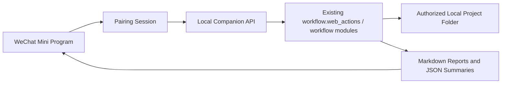

# WeChat Local Companion Mini Program Design

Date: 2026-05-25

## Summary

The first mobile product will be a WeChat mini program that acts as a gentle research companion for the existing local-first research workflow stack. It will not replace the Python workflow or the local browser workbench. Instead, it will connect to a companion service running on the user's computer, trigger selected local workflow actions, and present the results in a softer mobile interface.

The approved V1 scope is:

- Project dashboard
- Report center
- Local computer pairing
- Triggering a small set of existing local workflow actions
- Reading generated report summaries and full Markdown outputs

V1 intentionally excludes literature editing, simulation file upload, chart configuration, and manuscript editing.

## Product Type

The product type is a local-first WeChat mini program for research workflow monitoring and report access.

It should feel like a lightweight research assistant, not an admin console. The mobile experience should translate command-oriented workflows into task-oriented language:

- "Start a project check" instead of `project check`
- "Update reports" instead of command names
- "Today, handle these first" instead of raw diagnostics
- "Writing materials" and "literature map" instead of backend output labels

The mini program is a mobile control surface for an existing desktop workflow stack.

## Target Users

The primary users are graduate students and researchers in mechanical, manufacturing, engineering, and adjacent applied research fields who already manage a local project folder containing literature, notes, simulation data, figures, and manuscript drafts.

These users usually continue to rely on Zotero, Word, simulation tools, and local files. They want a simpler way to check research readiness from a phone without opening a command line or navigating the full desktop workbench.

Secondary users may include supervisors, collaborators, or project group members who need to review project health reports and writing material packs without editing source data.

## Visual Direction

The approved visual direction is the softer V2 concept:

- Low-contrast borders and subtle shadows
- Light status blocks rather than large saturated panels
- Gentle green, blue, warm, and rose accents
- Fewer heavy buttons
- Lightweight action rows for primary actions
- Summary-first result cards
- Full Markdown and raw output placed behind detail views

The interface should feel professional, calm, and supportive. It should not resemble a dense SaaS dashboard or system administration screen.

## Core V1 Functions

### 1. Connection Page

The connection page helps the phone connect to the local companion service running on the user's computer.

It should support:

- Showing whether the phone is connected to a local workbench
- Scanning a pairing QR code or entering a one-time PIN
- Showing the connected computer name
- Disconnecting and reconnecting
- Explaining that the computer must keep the local service running

### 2. Project Dashboard

The dashboard is the default first screen after connection.

It should show:

- Current project name or path alias
- Connection state
- Last check time
- A short project health summary
- A "today's research progress" style summary
- A prioritized next-step recommendation
- A lightweight action to start a project check

The dashboard should avoid showing raw command names by default.

### 3. Run Page

The run page exposes a small set of safe local actions:

- Workflow status
- Project overview report
- Project health check
- Update common reports

Each action should display:

- Running state
- Success state
- Failure state with likely next checks
- A summary card above raw output

### 4. Report Center

The report center lets the user generate and read commonly used reports:

- Writing material pack
- Writing dashboard
- Literature comparison table
- Literature map
- Literature tracking checklist
- Project health report

Reports should show an approachable card summary first, with a detail view for the full Markdown output.

## Technical Architecture

V1 uses a local-first companion architecture.



### WeChat Mini Program

Recommended stack:

- Native WeChat mini program
- TypeScript
- WXML
- WXSS
- Native page state for V1
- Lightweight store only if state sharing becomes messy

Native mini program development is preferred over a cross-platform framework for V1 because the first version is small, connection-sensitive, and tied to WeChat-specific pairing and request constraints.

### Local Companion Service

Recommended stack:

- Python
- A new module such as `workflow.mobile_app`
- Reuse existing workflow modules and `workflow.web_actions`
- JSON API responses
- Markdown report payloads for full report views

The V1 API layer will use Python standard library HTTP serving to avoid new dependencies and stay aligned with the current local-first distribution model. If the API grows beyond the V1 dashboard and report center, FastAPI can be introduced later for request validation, routing, and OpenAPI documentation.

### API Shape

The local API should return structured JSON for mobile cards and include raw Markdown output where useful.

Example response shape:

```json
{
  "ok": true,
  "action": "project_check",
  "summary": {
    "title": "Project check complete",
    "primaryMessage": "5 items need attention",
    "nextAction": "Fill missing reading notes, then update the writing pack"
  },
  "cards": [
    {
      "label": "Literature",
      "status": "needs_attention",
      "message": "2 notes missing, 1 PDF missing"
    }
  ],
  "markdown": "# Project Check\n..."
}
```

## Pairing and Permissions

The local service should not expose arbitrary filesystem access.

V1 will use:

- A pairing QR code or one-time PIN displayed on the computer
- A short-lived session token
- An allowlist of authorized project roots
- Read/write access only inside the selected project root
- Local-network binding only by default
- Clear connected/disconnected states in the mini program

Because WeChat mini program production networking has domain and HTTPS constraints, V1 is scoped for local development and small-scope testing with the desktop companion. Production release will be treated as a later packaging and networking project, likely requiring a secure relay, registered domain, or cloud pairing layer.

## Data Flow

1. User starts the local companion service on the computer.
2. Computer shows a pairing QR code or PIN.
3. User opens the WeChat mini program and pairs with the computer.
4. Mini program requests the current project dashboard.
5. User starts a check or report update.
6. Local service runs the existing Python workflow action.
7. Local service returns structured cards and raw Markdown.
8. Mini program displays a soft summary first and keeps the raw report in a detail view.

## Error Handling

V1 should handle these cases clearly:

- Computer service is offline
- Phone and computer cannot reach each other
- Pairing code expired
- Project root is not selected
- Project root is outside the allowlist
- Workflow action fails
- Report file cannot be written
- The generated report has warnings but still completed

Error messages should tell the user what to check next, not just show stack traces.

## Testing Strategy

Testing should focus on the boundary between the mobile API and existing workflow code.

Recommended coverage:

- Unit tests for local API action dispatch
- Tests that verify authorized project root enforcement
- Tests for JSON response shape for dashboard, project check, and report center actions
- Existing Python workflow tests remain the source of truth for report content
- Manual mini program testing for pairing, disconnected state, running state, and report viewing

## V1 Non-Goals

V1 does not include:

- Cloud sync
- User accounts
- Multi-user collaboration
- Editing literature entries on the phone
- Uploading simulation data from the phone
- Configuring figure parameters on the phone
- Editing or annotating manuscripts
- Replacing the existing local web workbench

## Future Extensions

After V1 proves the connection and report workflow, V2 can add:

- Literature quick entry
- Reading-card editing
- Phone file upload for CSV and DOCX
- Figure parameter presets
- Manuscript issue drill-down
- Optional cloud workspace
- Cross-device report history

## V1 Implementation Defaults

V1 should use these defaults:

- Local API module: `workflow.mobile_app`
- HTTP server: Python standard library
- Mini program stack: native WeChat mini program with TypeScript, WXML, and WXSS
- Pairing: computer-displayed QR code plus one-time PIN fallback
- Session security: short-lived token scoped to authorized project roots
- Report persistence: reuse existing standard report files where available and return structured summaries plus raw Markdown in API responses
- Production networking: deferred to a later release after local companion V1 is validated
